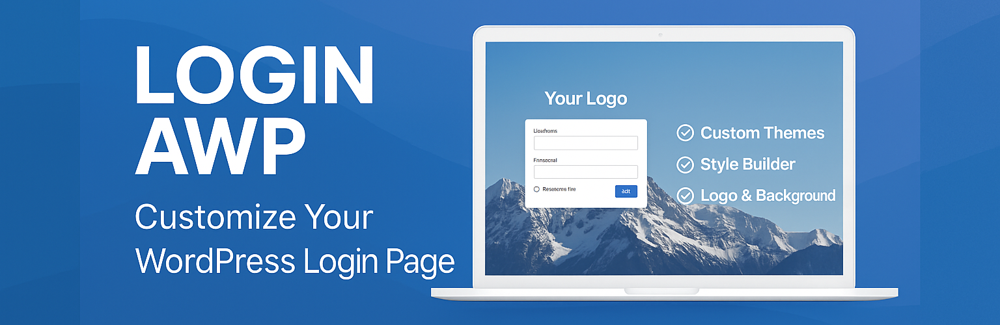

<p align="center">
  
</p>

<h1 align="center">Login AWP</h1>

<p align="center">
  <b>Professional WordPress Login Page Customization</b>
</p>

<p align="center">
  <a href="https://wordpress.org/plugins/login-awp/"></a>
  <a href="https://wordpress.org/plugins/login-awp/"></a>
  <a href="https://wordpress.org/plugins/login-awp/"></a>
  <a href="https://wordpress.org/plugins/login-awp/"></a>
  <a href="https://www.paypal.com/donate/?hosted_button_id=32A55GWU7JKY4"></a>
</p>

## 📋 Table of Contents

- [Overview](#-overview)
- [Features](#-features)
- [Screenshots](#-screenshots)
- [Installation](#-installation)
- [Configuration](#-configuration)
- [Frequently Asked Questions](#-frequently-asked-questions)
- [Changelog](#-changelog)
- [Contributing](#-contributing)
- [License](#-license)
- [Credits](#-credits)

## 🔍 Overview

Login AWP transforms your WordPress login page with a professional, customizable interface that enhances your brand presence from the very first user interaction. Stop settling for the default WordPress login page and create a seamless branded experience in just a few clicks.

**Key Benefits:**
- Instantly enhance your login page aesthetics
- Reinforce brand identity through custom elements
- Choose from pre-designed themes or create your own
- Fully responsive design works on all devices
- Simple configuration with powerful customization options

## 🚀 Features

### Basic Customization
- **Custom logo upload** - Replace the WordPress logo with your brand
- **Background image with transitions** - Create visually engaging login screens
- **Responsive design** - Perfect experience across all devices

### Theme System
- **Pre-designed themes** - Multiple professional layouts to choose from
- **One-click application** - Instantly transform your login page
- **Live preview** - See changes before applying them

### Style Builder
- **Complete design control** - Customize every visual aspect
- **Color customization** - Match your brand colors perfectly
- **Typography settings** - Adjust fonts for optimal readability
- **Layout fine-tuning** - Control borders, margins, and padding
- **Real-time preview** - See changes as you make them

### User Feedback
- **Review system** - Helps improve the plugin through user suggestions
- **Non-intrusive** - Only appears for administrators at appropriate times
- **Privacy-focused** - Fully dismissible with permanent opt-out

## 📷 Screenshots

1. **Login Page with Custom Branding**
2. **Theme Selection Interface**
3. **Style Builder Dashboard**
4. **Mobile Responsive Design**
5. **Custom Background Options**
6. **Admin Configuration Panel**

## 📥 Installation

### From WordPress Admin
1. Go to **Plugins > Add New**
2. Search for "Login AWP"
3. Click "Install Now" and then "Activate"

### Manual Installation
1. Download the latest version from [WordPress.org](https://wordpress.org/plugins/login-awp/) or [GitHub Releases](https://github.com/Alexsanchez-WP/Login-AWP_WordPress_Plugin/releases)
2. Upload the entire `login-awp` folder to `/wp-content/plugins/` directory
3. Activate the plugin through the 'Plugins' menu in WordPress

### Development Setup
If you're working with the development version, you'll need to install dependencies:

```sh
cd trunk
composer dump-autoload
```

## ⚙️ Configuration

After activation, you can configure Login AWP by navigating to:

1. WordPress Admin → Appearance → Login
2. From here you can:
   - Upload your custom logo
   - Set a background image
   - Choose a theme or create your own
   - Access the Style Builder for advanced customization

## ❓ Frequently Asked Questions

For detailed answers to common questions, please visit our [Wiki](https://github.com/Alexsanchez-WP/Login-AWP_WordPress_Plugin/wiki/Frequently-Asked-Questions).

## 📝 Changelog

### 3.2.1 (2025-05-04)
* Fixed critical error when activating the plugin on certain hosting environments
* Improved plugin activation to properly initialize feedback options on first install
* Enhanced error handling during plugin activation process
* Eliminated external settings.php dependency for better reliability

### 3.2.0
* Fixed AJAX error during plugin deactivation feedback submission
* Corrected issue with feedback submission pointing to incorrect domain
* Enhanced error handling for feedback email and webhook submissions
* Improved fallbacks for email delivery when feedback settings are incomplete
* Enhanced data sanitization for feedback submissions

### 3.1.0
* Added user feedback system for administrators to help improve the plugin
* Enhanced compatibility with older PHP versions
* Fixed various minor styling issues 

### 3.0.0
* Added theme selection system with pre-designed layouts
* Visual Style Builder for advanced customization
* Custom fonts, colors, spacing, and border settings

### 2.1.0
* Added status notifications for image updates
* Added Spanish language translation

### 2.0.0
* Plugin moved to Appearance menu for easier access
* Added logo and background image customization

### 1.1.0
* Fixed: Automatically display custom site icon on login page if available

### 1.0.0
* Initial stable release

For a more detailed changelog, please see [CHANGELOG.md](CHANGELOG.md).

## 👥 Contributing

Contributions are welcome! Please feel free to submit a Pull Request.

1. Fork the repository
2. Create a feature branch: `git checkout -b feature/amazing-feature`
3. Commit your changes: `git commit -m 'Add some amazing feature'`
4. Push to the branch: `git push origin feature/amazing-feature`
5. Open a Pull Request

## 📜 License

This project is licensed under the GNU General Public License v2.0 - see the [LICENSE.md](LICENSE.md) file for details.

## 🙏 Credits

- [Vegas2 JS](https://vegas.jaysalvat.com/) - Used for background image transitions
- All the [contributors](https://github.com/Alexsanchez-WP/Login-AWP_WordPress_Plugin/graphs/contributors) who have helped improve this plugin

---

<p align="center">
  <sub>Developed with ❤️ by <a href="https://github.com/Alexsanchez-WP">Alexsanchez-WP</a></sub>
</p>
