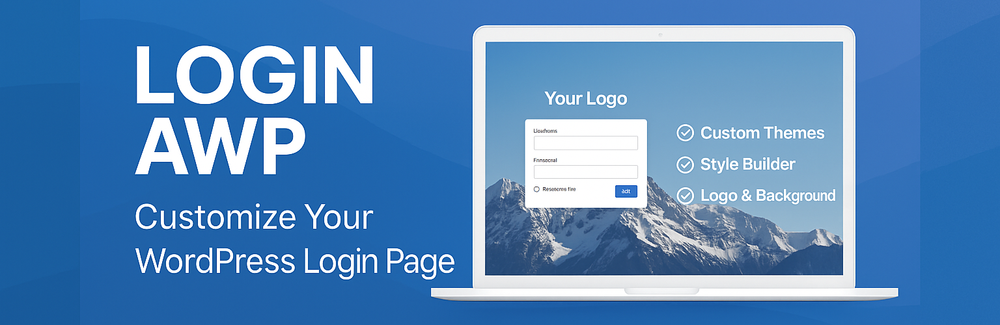

# Manual del Usuario - Login AWP

## Índice
1. [Introducción](#introducción)
2. [Instalación](#instalación)
3. [Configuración General](#configuración-general)
4. [Personalización del Fondo](#personalización-del-fondo)
5. [Temas Prediseñados](#temas-prediseñados)
6. [Constructor de Estilos](#constructor-de-estilos)
7. [Preguntas Frecuentes](#preguntas-frecuentes)
8. [Solución de Problemas](#solución-de-problemas)
9. [Desinstalación](#desinstalación)
10. [Soporte](#soporte)

## Introducción

Login AWP es un plugin que mejora la pantalla de inicio de sesión de WordPress con potentes funciones de personalización. Con este plugin, puedes transformar completamente la apariencia de tu página de login sin necesidad de conocimientos de programación.

### Características Principales

- **Personalización de Logo**: Sube tu propio logo para reemplazar el icono predeterminado de WordPress.
- **Imágenes de Fondo**: Agrega una imagen de fondo personalizada con transiciones elegantes.
- **Temas Prediseñados**: Elige entre una variedad de temas prediseñados con un solo clic.
- **Constructor de Estilos Visual**: Personaliza colores, fuentes, bordes, espaciado y más usando una interfaz visual intuitiva.
- **Diseño Responsivo**: Visualización perfecta en todos los dispositivos, desde móviles hasta pantallas de escritorio.
- **Soporte Multilingüe**: Disponible en inglés y español.

## Instalación

Hay dos formas de instalar el plugin Login AWP:

### A través del Directorio de Plugins de WordPress

1. En tu panel de administración de WordPress, ve a **Plugins → Añadir Nuevo**.
2. Busca "Login AWP" en el campo de búsqueda.
3. Haz clic en **Instalar Ahora** junto a "Login AWP".
4. Una vez instalado, haz clic en **Activar**.

### Mediante Carga Manual

1. Descarga la última versión del plugin desde [wordpress.org](https://wordpress.org/plugins/login-awp/).
2. En tu panel de administración de WordPress, ve a **Plugins → Añadir Nuevo → Subir Plugin**.
3. Selecciona el archivo ZIP descargado y haz clic en **Instalar Ahora**.
4. Una vez instalado, haz clic en **Activar**.

## Configuración General

Para acceder a la configuración del plugin:

1. Ve a **Apariencia → Login** en tu panel de administración de WordPress.
2. La primera pestaña que verás es "General", donde puedes configurar las opciones básicas.

### Personalización del Logo

Para cambiar el logo que aparece en la pantalla de inicio de sesión:

1. En la pestaña "General", busca la sección "Logo".
2. Haz clic en el botón **Seleccionar imagen**.
3. Sube una nueva imagen o selecciona una de la biblioteca de medios.
4. Haz clic en **Seleccionar** y luego en **Guardar Cambios**.

**Recomendaciones para el logo:**
- Tamaño ideal: 320px × 80px
- Formatos recomendados: PNG o SVG (para mejor calidad)
- Utiliza imágenes con fondo transparente para mejor integración

Para eliminar el logo personalizado y volver al logo predeterminado de WordPress:
1. Haz clic en el botón **Eliminar imagen**.
2. Guarda los cambios.

## Personalización del Fondo

Para cambiar la imagen de fondo de la pantalla de inicio de sesión:

1. En el menú **Apariencia → Login**, selecciona la pestaña "Fondo".
2. Haz clic en el botón **Seleccionar imagen**.
3. Sube una nueva imagen o selecciona una de la biblioteca de medios.
4. Haz clic en **Seleccionar** y luego en **Guardar Cambios**.

**Recomendaciones para la imagen de fondo:**
- Resolución recomendada: 1920px × 1080px o superior
- Tamaño óptimo: Menos de 500KB (para tiempos de carga rápidos)
- Formatos recomendados: JPG o WEBP (mejor relación calidad/tamaño)
- Considera usar imágenes que no sean demasiado coloridas o detalladas para mantener la legibilidad

## Temas Prediseñados

Login AWP incluye varios temas prediseñados que puedes aplicar con un solo clic para transformar instantáneamente tu página de inicio de sesión:

1. En el menú **Apariencia → Login**, selecciona la pestaña "Temas".
2. Se mostrará una galería de temas disponibles.

3. Para previsualizar un tema, haz clic en el botón **Previsualizar**. Esto te permite ver cómo se verá el tema antes de aplicarlo.

4. Si ya tienes un estilo predefinido activo, se te pedirá confirmar el reemplazo. Haz clic en **Aceptar** para proceder con el reemplazo, o **Cancelar** para mantener tu estilo actual.

5. Para aplicar un tema, haz clic en el botón **Seleccionar Tema**. El tema se aplicará inmediatamente a tu página de inicio de sesión.

### Características de los Temas Prediseñados

* **Estilo Completo**: Cada tema cambia automáticamente la apariencia completa de la página de inicio de sesión, incluyendo colores, estilos y disposición de elementos.
* **Diseño Responsivo**: Todos los temas prediseñados son completamente responsivos y se verán geniales en cualquier dispositivo.
* **Personalizables**: Después de aplicar un tema, puedes seguir haciendo personalizaciones adicionales usando el Constructor de Estilos.
* **Aplicación con Un Clic**: Cambia rápidamente toda la apariencia de tu página de inicio de sesión sin ningún ajuste manual.
* **Diseños Profesionales**: Creados por diseñadores profesionales para garantizar una experiencia de inicio de sesión atractiva y fácil de usar.

### Colecciones de Temas Disponibles

Login AWP ofrece varias colecciones de temas:

* **Temas Modernos**: Diseños limpios y contemporáneos con degradados suaves y sombras sutiles.
* **Temas Corporativos**: Temas profesionales perfectos para sitios web empresariales.
* **Temas Creativos**: Diseños artísticos con disposiciones únicas para profesionales creativos.
* **Temas Minimalistas**: Temas simples y elegantes enfocados en elementos esenciales.

¡Prueba diferentes temas para encontrar la combinación perfecta para la identidad de tu marca y el estilo de tu sitio web!

## Constructor de Estilos

El Constructor de Estilos te permite personalizar completamente cada aspecto visual de la página de inicio de sesión:

1. En el menú **Apariencia → Login**, selecciona la pestaña "Constructor de Estilos".
2. A la izquierda verás paneles de control para diferentes elementos.
3. A la derecha se mostrará una vista previa en tiempo real de tus cambios.

### Personalización de Colores

Puedes modificar los colores de todos los elementos:
- **Fondo del Formulario**: Color del panel donde se encuentra el formulario de login.
- **Texto**: Color del texto general y enlaces.
- **Campos de Entrada**: Color de fondo y bordes de los campos de usuario y contraseña.
- **Botón de Inicio de Sesión**: Color de fondo, texto y bordes del botón.

### Personalización de Tipografía

Para cambiar la fuente:
1. Selecciona una familia de fuentes del menú desplegable.
2. Ajusta el tamaño del texto usando los controles deslizantes.

### Personalización de Bordes y Espaciado

1. Usa los controles para ajustar el radio de los bordes (para esquinas más o menos redondeadas).
2. Modifica el espaciado interno (padding) para ampliar o reducir el espacio dentro de los elementos.
3. Ajusta los márgenes para controlar la separación entre elementos.

### Aplicar y Guardar Estilos

Una vez que hayas realizado todos los cambios deseados:
1. Verifica la apariencia en la vista previa.
2. Haz clic en **Guardar Estilos** para aplicar los cambios.

## Preguntas Frecuentes

### ¿Puedo usar mi propio CSS personalizado?
Sí, en la pestaña "Constructor de Estilos" encontrarás un área de texto para CSS personalizado donde puedes agregar tus propias reglas de estilo.

### ¿El plugin afecta al rendimiento de mi sitio?
No. Login AWP solo carga sus recursos en la página de inicio de sesión, sin afectar al rendimiento del resto del sitio.

### ¿Es compatible con otros plugins de seguridad?
Sí, Login AWP es compatible con la mayoría de los plugins de seguridad y limitación de intentos de inicio de sesión.

### ¿Funciona con la autenticación de dos factores?
Sí, funciona perfectamente con plugins de autenticación de dos factores.

### ¿Puede usarse en sitios multisitio de WordPress?
Sí, el plugin es totalmente compatible con instalaciones multisitio.

## Solución de Problemas

### La página de inicio de sesión no muestra mis cambios
1. **Borra la caché**: Limpia la caché de tu navegador o usa el modo incógnito para verificar.
2. **Conflictos con plugins**: Desactiva temporalmente otros plugins que puedan estar modificando la página de inicio de sesión.
3. **Conflictos de CSS**: Si usas CSS personalizado, verifica que no haya reglas conflictivas.

### Las imágenes de fondo tardan en cargar
1. Optimiza el tamaño de tu imagen. Recomendamos archivos de menos de 500KB.
2. Convierte la imagen a formato WEBP para mejor rendimiento.

### El logo aparece distorsionado
1. Asegúrate de usar una imagen de alta calidad con las dimensiones recomendadas.
2. Verifica que la imagen tenga la proporción correcta.

## Desinstalación

Si deseas desinstalar el plugin:

1. Ve a **Plugins** en tu panel de administración de WordPress.
2. Encuentra "Login AWP" en la lista.
3. Haz clic en **Desactivar**.
4. Si deseas proporcionar feedback sobre por qué desactivas el plugin, puedes completar el formulario que aparece.
5. Para eliminar completamente el plugin, haz clic en **Borrar**.

**Nota**: Al desinstalar el plugin, se eliminarán todas las configuraciones personalizadas.

## Soporte

Si necesitas ayuda o tienes alguna pregunta:

- **Documentación Oficial**: [https://awp-software.com/docs-category/login-awp-plugin/](https://awp-software.com/docs-category/login-awp-plugin/)
- **Foro de Soporte**: [https://wordpress.org/support/plugin/login-awp/](https://wordpress.org/support/plugin/login-awp/)
- **Reportar Problemas**: Si encuentras algún error, por favor repórtalo en [GitHub](https://github.com/AWP-Software/Login-AWP_WordPress_Plugin/issues)

---

¿Te gusta Login AWP? Por favor, considera [dejar una valoración](https://wordpress.org/support/plugin/login-awp/reviews/?filter=5#new-post) para ayudarnos a mejorar el plugin.